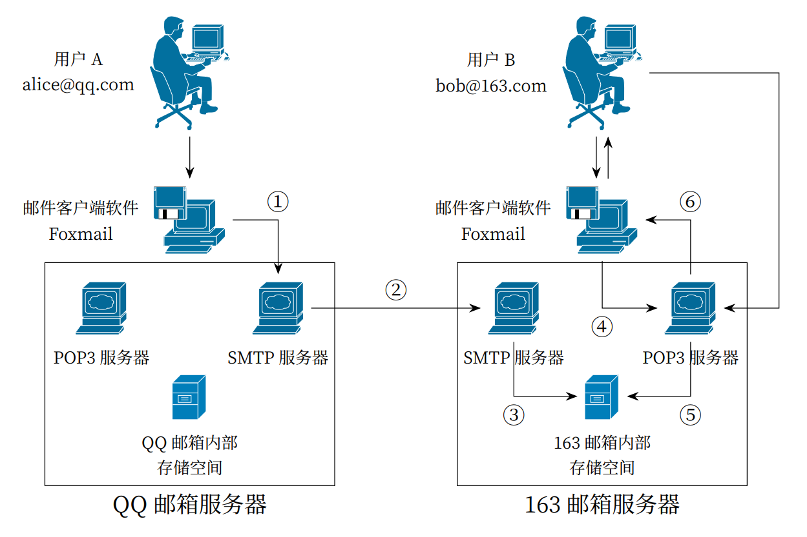

# SMTP邮件客户端

## 原理

### 电子邮件的发送和接收过程

这里先给出用户A从QQ邮箱发送邮件到用户B 163邮箱的图示，然后对图示的过程进行详细的介绍：



### SMTP协议工作机制

SMTP（Simple Mail Transfer Protocol，简单邮件传输协议）定义了邮件客户端与SMTP服务器之间，以及两台SMTP服务器之间发送邮件的通信规则。SMTP协议属于TCP/IP 协议族，通信双方采用一问一答的命令/响应形式进行对话，且有一定的对话的规则和所有命令/响应的语法格式。

SMTP协议分为标准SMTP协议和扩展SMTP 协议，标准SMTP协议是1982年在RFC 821文档中定义的，而扩展SMTP协议是1995年在RFC 1869文档中定义的。扩展SMTP协议在标准SMTP协议基础上的改动非常小，主要增加了邮件安全方面的认证功能，现在我们说的SMTP 协议基本上都是扩展SMTP协议。

RFC 1869文档链接：https://www.rfc-editor.org/rfc/rfc1869.html。

SMTP 协议中一共定义了18条命令，但是发送一封电子邮件的过程通常只需要6条命令，这6条命令/响应的语法格式总结如下：

1） **EHLO <domain><CR><LF>** ：

EHLO命令是SMTP邮件发送程序与SMTP邮件接收程序建立连接后必须发送的第一条SMTP命令，参数<domain>表示 SMTP邮件发送者的主机名。EHLO命令用于替代传统SMTP协议中的HELO命令。

2） **AUTH <para><CR><LF>**

如果SMTP邮件接收程序需要SMTP邮件发送程序进行认证时，它会向SMTP邮件发送程序提示它所采用的认证方式，SMTP邮件发送程序接着应该使用这个命令回应SMTP邮件接收程序，参数<para>表示回应的认证方式，通常是SMTP邮件接收程序先前提示的认证方式。

3） **MAIL FROM: <reverse-path><CR><LF>**

用于指定邮件发送者的邮箱地址，参数<reverse-path>表示发件人的邮箱地址。

4） **RCPT TO: <forward-path><CR><LF>**

用于指定邮件接收者的邮箱地址。参数<forward-path>表示接收者的邮箱地址。如果邮件要发送给多个接收者，那么应使用多条RCPT TO命令来分别指定每一个接收者的邮箱地址。

5） **DATA<CR><LF>**

用于输入邮件内容。该命令后面发送的所有数据都将被当做邮件内容，直至遇到结束标志字符串“<CR><LF>.<CR><LF>” 。之后，邮件内容结束。

6） **QUIT<CR><LF>**

结束与SMTP服务器的通信。

### POP3协议工作机制

POP3（Post Office Protocol version 3）定义了邮件客户端与POP3服务器之间的通信规则。与SMTP协议类似，POP3协议中，通信双方采用一问一答的命令/响应形式进行对话。

POP3是POP（Post Office Protocol）中最为广泛流传的版本，它最初在RFC 1081中定义。最近的版本是RFC 1939，带有扩展机制（在RFC 2449中定义）。认证机制则在RFC 1734中详细说明。

RFC 1939文档链接：https://www.rfc-editor.org/rfc/rfc1939.html。

这里总结了POP3协议常用的9条命令如下：

1） **USER <name><CR><LF>**

用于输入认证用户名。

2） **PASS <name><CR><LF>**

用于输入认证口令。

3） **STAT<CR><LF>**

返回邮箱统计信息，包括邮箱邮件数和邮件占用的大小。

4） **LIST [<msg>]<CR><LF>**

返回邮件信息。参数可选。若指定参数，则返回的是编号为msg的邮件编号及大小（以字节为单位）；若不指定参数，则返回所有邮件的编号及大小。

5） **RETR msg<CR><LF>**

获取编号为msg的邮件正文。服务器返回的内容里第一行是邮件大小（以字节为单位），之后是邮件内容，最后一行是“.”，表示结束。

6） **DELE msg<CR><LF>**

删除编号为msg的邮件。此命令会对邮件做上标记，但不会立即删除，而是在POP3通信结束后才会删除有标记的邮件。

7） **RSET<CR><LF>**

撤销所有的DELE操作。

8） **NOOP<CR><LF>**

空操作，什么也不做。

9） **QUIT<CR><LF>**

结束与POP3服务器的通信。

### Internet消息格式

当我们写信时，我们通常需要在信的顶部写下一些基本信息，如收件人地址、发件人地址、日期等，这些都是信的格式要求。电子邮件也有格式要求。与纸质信类似，在正文开始前，通常需要包含一些邮件头。电子邮件消息的格式在RFC 5322 Internet Message Format中有详细规定。一些常见的邮件头介绍如下。

| 邮件头      | 含义           |
| ----------- | -------------- |
| To:         | 收信人邮件地址 |
| Cc:         | 抄送人邮件地址 |
| Bcc:        | 密送人邮件地址 |
| From:       | 写信人邮件地址 |
| Message-Id: | 邮件惟一标识符 |
| Keywords:   | 邮件关键词     |
| Subject:    | 邮件主题       |

以下为一个典型的电子邮件内容：

以下为一个典型的电子邮件内容：

```
1From: alice@qq.com
2To: bob@163.com
3Message-Id: <0704760941.AA00747@163.com>
4Subject: New Year Greetings
5
6Happy New Year, Bob!!!
```

该邮件中指定的头部信息有写信人、收信人、邮件标识符和主题。“Happy New Year, Bob!!!”是正文部分。

早期的电子邮件只能发送ASCII字符组成的纯文本。为了能够发送更多的字符及多媒体内容，MIME（Multipurpose Internet Message Extensions）被提出。MIME在RFC 2045-2049中规定。MIME被广泛用于电子邮件中，也用来描述其他应用的内容，如Web浏览。

MIME的做法是在最基础的纯文本消息的格式上增加一些规则以及编码规则，以此传送非ASCII码消息。这样，MIME消息仍然能被旧的邮件协议识别、传送、接收，需要修改的只是邮件发送和接收客户端。

MIME定义了五个相关的邮件头，如下表所示。

| 邮件头                     | 含义               |
| -------------------------- | ------------------ |
| MIME-Version:              | MIME版本           |
| Content-Description:       | 内容描述           |
| Content-Id:                | 内容的惟一标识符   |
| Content-Transfer-Encoding: | 内容传送所用的编码 |
| Content-Type:              | 内容的类型和格式   |

Content-Description是必要的，这样接收人就能判断是否值得解码这段内容。比如，对方给你发送一个“XX大学成绩单”，但对方的邮件地址并非学校官方地址，那么你判断这大概率是诈骗邮件，所以你不会去解码这段内容。

对于非ASCII码内容，通常会使用Base64编码，这个需在Content-Transfer-Encoding中指出。除了Base64编码，MIME还规定了许多可用的编码选项，有兴趣的同学可以阅读MIME规范文档。

Content-Type规定了消息体的属性。最初，RFC 1521定义了七种MIME类型。每种类型都有几个子类型。类型和子类型之间用斜杠隔开，如“Content-Type: video/mpeg”。之后，许多新的MIME类型和子类型进入了规范。当前支持的类型和子类型可在IANA网站上查询，网址： https://www.iana.org/assignments/media-types/media-types.xhtml

下表列出了几种常见的MIME类型和子类型。

| 类型        | 常见子类型                           | 说明               |
| ----------- | ------------------------------------ | ------------------ |
| text        | plain, html, xml, css                | 各种格式的文本     |
| image       | gif, jpeg. tiff                      | 图片               |
| audio       | basic, mpeg, mp4                     | 音频               |
| video       | mpeg, mp4, quicktime                 | 视频               |
| model       | vrml                                 | 3D模型             |
| application | octet-stream, javascript, pdf, zip   | 应用程序产生的数据 |
| message     | http, rfc822                         | 封装的消息         |
| multipart   | mixed, alternative, parallel, digest | 多种类型的消息     |

这里我们特别说明以下application/octet-stream、message 和multipart。其他子类型可以去RFC文件中了解。

首先是application/octet-stream。尽管MIME规定了许多种格式的消息，但总有一些文件格式无法涵盖。这时，我们可以用application/octet-stream来描述该消息的格式，告诉邮件客户端，这段消息应当复制进一个文件，再打开。后面如何打开，由用户操作。邮件附件可以使用这种子类型表示。

而message和multipart通常用于构造和操作消息本身。message类型允许一条消息完整地封装在另一个消息中，所以常常被用于邮件回复、转发等。multipart类型允许一条消息含有不同的部分，每个部分含有不同格式的内容。mixed子类型说明消息是由几个部分简单组合而成，每个部分的消息都不同。比如，在发送邮件正文后，如果还想再发送图片或者视频，则应该规定Content-Type为multipart/mixed，再分别将邮件正文和其他文件放在邮件中。与mixed不同，alternative则允许包含多条内容相同但格式不同的消息。例如，HTML消息已经被广泛采用，它可以呈现富文本。但可能有极少数机器不支持HTML消息，只支持最原始的纯文本消息。这时，就可以指定邮件正文的类型为mutipart/alternative，并将HTML消息和纯文本消息都包含在正文中。

使用multipart的邮件内容通常还需要指定一个边界，用以分隔不同部分内容。

## 例子

### telnet命令发送邮件

```
//在命令行中输入
telnet smtp.qq.com 25

Trying 58.251.106.181...
Connected to smtp.qq.com.
Escape character is '^]'.
220 newxmesmtplogicsvrsza8.qq.com XMail Esmtp QQ Mail Server.

//在命令行中输入
EHLO qq.com

250-newxmesmtplogicsvrszc10.qq.com
250-PIPELINING
250-SIZE 73400320
250-STARTTLS
250-AUTH LOGIN PLAIN XOAUTH XOAUTH2
250-AUTH=LOGIN
250-MAILCOMPRESS
250 8BITMIME

//紧接着输入
AUTH login

334 VXNlcm5hbWU6

//输入qq邮箱名，qq邮箱名需base64编码，可参考上述“printf "username" | openssl base64”命令来编码
XXXXXXXXXXXX

334 UGFzc3dvcmQ6

//输入qq邮箱授权码，需base64编码，可参考上述“printf "username" | openssl base64”命令来编码
XXXXXXXXXXXXXXXXXXXXXXXX

235 Authentication successful

//输入指定邮件发送者的邮箱地址
MAIL FROM:<XXXXXXXXXX@qq.com>

250 OK

//输入邮件接收者的邮箱地址
RCPT TO:<XXXXXXXXXX@qq.com>

250 OK

//输入邮件内容
data

354 End data with <CR><LF>.<CR><LF>.

//设置邮件主题和邮件内容，最后输入.表示邮件
subject:I love computer networks!
from:XXXXXXXXXX@qq.com

I love computer networks!
.

250 OK: queued as.

//结束与SMTP服务器的通信
quit

221 Bye.
Connection closed by foreign host.
```

### telnet命令获取邮件

```
//输入邮件服务器为pop.qq.com，连接端口为110
telnet pop.qq.com 110

Trying 157.148.54.34...
Connected to pop.qq.com.
Escape character is '^]'.
+OK XMail POP3 Server v1.0 Service Ready(XMail v1.0)

//输入qq邮箱，此处不需要加密。
user XXXXXXXXXX@qq.com
+OK

//输入qq邮箱的授权码（不是密码），此处不需要加密
pass XXXXXXXXXXXXXXXX

+OK

//查看邮件列表
list

+OK

1 ****
2 ****
3 ****
.

//返回参数1 邮件的全部内容
retr 1

+OK 14712
……

//断开连接
quit

+OK Bye
Connection closed by foreign host.
```

## 使用方法

当你代码编写就绪后，使用下述命令编译程序：

```
make
```

运行下述命令发送一封邮件（各项参数请自行替换为有意义的字符串）：

```
./send -s "Mail subject" -m message.txt -a "attachment.zip" example@example.org
```

“attachment.zip”可以自己生成或指定。

运行下述命令与POP3服务器进行交互：

```
./recv
```
